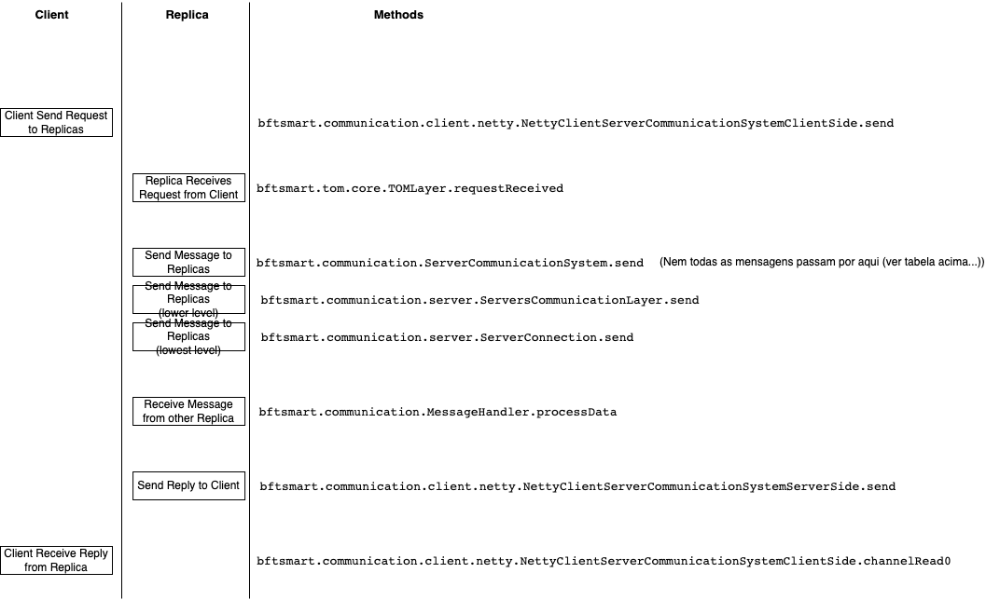
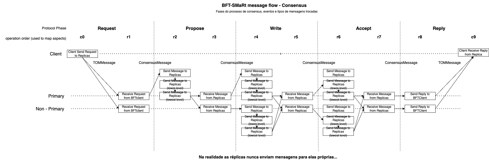

# Development Log

---

---

## Current Development State

>- __Coordinator Implementation__ - Partial
>  - __Global Fault schedule Parsing__ - Done (x)
>  - Coordinator Service implementation - Partial
>    - register - Done (x)
>    - notify - ()
>    - injectFault - ()
>
> 
>- __MonitorRuntime Implementation__ - Partial
>  - Registration process - Done(x)
>  - App State Monitoring - Partial ()
>    - Replica - Partial ()
>      - Consensus - Done (x)
>      - Leader Election / View Change - ()
>      - Checkpoint - ()
>      - Recovery - ()
>    - Client - On going ()
>  - Monitor Fault Schedule - Partial
>    - init - Done (x)
>    - injectFault - ()
>      - Replica - ()
>      - Client - ()
>  - Monitor Fault Triggering - 
>    - injectFault - On going ()
>      - Replica - Done (x)
>      - Client - On going ()
>
>
>- __Testing & Evaluation__

## Development History: 

> __Current Tasks__
>
> - Implement client faults (__on_going__)
>   - ~~Client State Monitoring~~ (__done__)
>   - ~~Client Fault Schedule Parsing~~ (__done__)
>   - ~~Client Registering~~ (__done__)
>   - Client Fault Injection (__on_going__)
> - Implemented faults (__on_going__)
>   - ~~Independent Faults~~ (__done__)
>     - ~~Crash Node Fault~~ (__done__)
>   - Network related faults
>     - ~~Delay Message Fault~~ (__done__)
>     - ~~Drop Message Fault~~ (__done__)
>     - ~~Duplicate Message Fault~~ (__done__)
>     - Reorder Message Fault
>     - Corrupt Message Fault
>   - Semantic Faults
>     - ~~Send requests to primary only~~ (__done__)
>     - ~~Send requests to secondary only~~ (__done__)
>     - Send different requests to each replica
>     - Send different requests to primary vs secondaries
>     - Modify message fields (consensus_id, view_id, operations, response, etc.) 
>

> __Next Tasks__
> 
> - Get next fault based on current application state (__partially done__)
>   - Currently only target replica/client state is being for validating triggering conditions
> - Define and implement the set of faults for each sub-protocol (view change/leader election, checkpoint, recovery)

> __Concluded Tasks__
>
> - ~~Define the set of faults to implement (__done__)~~
> - ~~Implement Replica Inject Fault (__done__)~~
>   - ~~Implement DropMessage & DuplicateMessage Faults (__done__)~~
>   - ~~Implement DelayMessage & NodeCrash Faults (__done__)~~
> - ~~Add Arguments to Faults (__done__)~~
>   - ~~FaultDescription must include a set of arguments (__done__)~~
>      - ~~Ex: {fault_type:type, fault_trigger_conditions:{}, fault_arguments:{}}~~
> - ~~Evaluate triggering conditions (__done__)~~
>   - ~~Replicas (__done__)~~
>   - ~~Clients (__done__)~~
> - ~~Determine next fault to inject based on node's current state (__done__)~~
>   - ~~Replicas (__done__)~~
>   - ~~Clients (__done__)~~
> - ~~Monitor application state (__done__)~~
>   - ~~Replicas (__done__)~~
>   - ~~Clients (__done__)~~
> - ~~Implement node registration (__done__)~~
>   - ~~Replicas (__done__)~~
>   - ~~Clients (__done__)~~
> - ~~Define Coordinator Service interface (__done__)~~
>   - ~~Create Service Stubs and Skeletons (__done__)~~ 

### What needs to be done (_TODO_ )

> - __Design/Define Faults__ 
>   - __Network/Communication based faults__
>     - ~~Drop Message (__done__)~~
>     - ~~Delay Message (__done__)~~
>     - ~~Duplicate Message (__done__)~~
>     - Corrupt Message 
>     - Re-Order message (_Can this be "done" using a C_ID(x+1) on message(x) and C_ID(x) on message(x+1)?_)
>   - __Semantic Faults__
>     - Clients
>       - ~~Send REQUEST message only to leader (__done__)~~
>       - ~~Send REQUEST message only to non-leaders (__done__)~~
>       - Send different REQUEST message to each/some Replica
>     - Replicas
>       - Leader/Primary
>         - Send different PROPOSAL message to each/some Replica
>       - All
>         - Send different WRITE/ACCEPT message to each/some Replica
>         - Send different REPLY message to Client
        
> __What is different REQUEST/PROPOSAL/WRITE/ACCEPT/REPLY messages?__ (different op? different ts? different hash?)

#### Further work and Redesign

- Handle fault schedules and leader changes, do schedules need to be synched after a leader change?
- Coordinator - Load global fault schedule when contacted during registering node 
  - Allows testing different schedules without need for restarting Coordinator
- Modifying fault injection 
  - So that faults are responsible evaluating trigger conditions (???)

---

---

# Zermia fault injection framework and implementation

This file describes the Zermia fault injection framework, and 
its information should be taken into consideration when updating
or modifying the source code.

It presents the mapping of Java class files and their purposes, 
and also describes how service modifications should be implemented.

## Java Class Mappings

- `zermia.common.schedule.*` &rarr; Java Classes representing global and per monitor fault schedule. Used when parsing yaml and json fault schedule description.
- `zermia.common.stats.*` &rarr; __UNUSED__
- `zermia.coordinator.clients.*` &rarr; Java Classes
- `zermia.coordinator.config.CoordinatorConfiguration.java` &rarr; Java Class representing Systems and Coordinator configuration
- `zermia.coordinator.proto.service.*` &rarr; Old Coordinator Service Implementation
- `zermia.coordinator.ZermiaCoordinatorMain.java` &rarr; Coordinator and Coordinator Service implementations
- `zermia.hooks.*` &rarr; Aspects for instantiating, accessing and updating Monitor Runtime
- `zermia.monitor.faults.*` &rarr; Fault implementations
- `zermia.monitor.runtime.clients.*` &rarr; __UNUSED__ (MonitorRuntime was previously implemented using ClientMonitorRuntime and ReplicaMonitorRuntime, for BFT clients and BFT replicas)
- `zermia.monitor.runtime.config.*` &rarr; Monitor Runtime configuration
- `zermia.monitor.runtime.proto.ZermiaCoordinatorStub.java` &rarr; Coordinator Service Stub
- `zermia.monitor.runtime.MonitorRuntime.java` &rarr; Monitor Runtime implementation (manages applications state and fault schedule execution)
- `zermia.monitor.state.*` &rarr; Java classes form managing application state
- `proto.ZermiaCoordinatorService.proto` &rarr; gRPC Coordinator Service definition

___
## Adding faults to framework

- update FaultArgumentsDeserializer.java to deserialize new fault disc (yaml or json) to global/monitor fault schedule
- Update ZermiaCoordinatorMain.java to serialize new fault
- Update ZermiaCoordinatorStub.java to deserialize new fault 
- Update ZermiaMonitorHooks.java to handle new fault

## Modifying Coordinator Service protocol

### Update service description (ZermiaCoordinatorService.proto)

- Add/remove/update service operations and messages (in `ZermiaCoordinatorService.proto` file)
- Update corresponding "Java Objects" (zermia.common.schedule.*) (see next section <a href="#faultparsing">Section</a>))
- Update Coordinator Service implementation and Coordinator Service Stub accordingly
  - Coordinator Service implementation &rarr; [ZermiaCoordinatorMain.java](src%2Fmain%2Fjava%2Fzermia%2Fcoordinator%2FZermiaCoordinatorMain.java)
  - Coordinator Service Stub implementation &rarr; [ZermiaCoordinatorStub.java](src%2Fmain%2Fjava%2Fzermia%2Fmonitor%2Fruntime%2Fproto%2FZermiaCoordinatorStub.java)

___

### 
 Fault schedule parsing (Yaml file)

- Define fault schedule description (to be included in `schedule.yaml` file)
- Add/Remove/Update fault schedule description (yaml file) 
- Create/Update corresponding Java class for mapping fault description to object in `common.schedule.*`
- Add custom parser/serializer/deserializer if needed (see `zermia.common.schedule.arguments.serializer.FaultArgumentsDeserializer`)
- Update Coordinator Service implementation and Coordinator Service Stub accordingly
  - Coordinator Service implementation &rarr; [ZermiaCoordinatorMain.java](src%2Fmain%2Fjava%2Fzermia%2Fcoordinator%2FZermiaCoordinatorMain.java)
  - Coordinator Service Stub implementation &rarr; [ZermiaCoordinatorStub.java](src%2Fmain%2Fjava%2Fzermia%2Fmonitor%2Fruntime%2Fproto%2FZermiaCoordinatorStub.java)
___
## BFT-SMaRt state monitoring (method mappings)

methods mapped to extract state

message.Send

message.receive

----

### BFTCounterServer test (original CounterServer is CFT (uses PAXOS))

#### Modified version of BFTCounterClient test (original -> single threaded; new -> multithreaded)
> `CounterClient <process id> <increment> [<number of operations>] [<number of clients>]`

- __Use bft_home env. var. for handling bft_smart path__
> `export bft_home="/Users/joaosoares/Dropbox/[ Documents ]/[Faculdade]/[ Research Projects ]/Hermes_Zermia_Proteus/projects/bft_smart-library-master"`

- __Server 0__
> `java -Duser.dir="$bft_home/build/local/rep0/" -Djava.security.properties="$bft_home/build/local/rep0/config/java.security" -Dlogback.configurationFile="$bft_home/build/local/rep0/config/logback.xml" -cp ".:$bft_home/build/local/rep0/:$bft_home/build/local/rep0/lib/*" bftsmart.demo.counter.BFTCounterServer 0`

- __Server 1__
> `java -Duser.dir="$bft_home/build/local/rep1/" -Djava.security.properties="$bft_home/build/local/rep1/config/java.security" -Dlogback.configurationFile="$bft_home/build/local/rep1/config/logback.xml" -cp ".:$bft_home/build/local/rep1/:$bft_home/build/local/rep1/lib/*" bftsmart.demo.counter.BFTCounterServer 1`

- __Server 2__
> `java -Duser.dir="$bft_home/build/local/rep2/" -Djava.security.properties="$bft_home/build/local/rep2/config/java.security" -Dlogback.configurationFile="$bft_home/build/local/rep2/config/logback.xml" -cp ".:$bft_home/build/local/rep2/:$bft_home/build/local/rep2/lib/*" bftsmart.demo.counter.BFTCounterServer 2`

- __Server 1__
> `java -Duser.dir="$bft_home/build/local/rep3/" -Djava.security.properties="$bft_home/build/local/rep3/config/java.security" -Dlogback.configurationFile="$bft_home/build/local/rep3/config/logback.xml" -cp ".:$bft_home/build/local/rep3/:$bft_home/build/local/rep3/lib/*" bftsmart.demo.counter.BFTCounterServer 3`

- __Client__
> `java -Duser.dir="$bft_home/build/local/cli0/" -Djava.security.properties="$bft_home/build/local/cli0/config/java.security" -Dlogback.configurationFile="$bft_home/build/local/cli0/config/logback.xml" -cp ".:$bft_home/build/local/cli0/:$bft_home/build/local/cli0/lib/*" bftsmart.demo.counter.CounterClient 1001 1 100`

### YCSBServer test
- __Use bft_home env. var. for handling bft_smart path__
> `export bft_home="/Users/joaosoares/Dropbox/[ Documents ]/[Faculdade]/[ Research Projects ]/Hermes_Zermia_Proteus/projects/bft_smart-library-master"`

- __Server 0__
> `java -Duser.dir="$bft_home/build/local/rep0/" -Djava.security.properties="$bft_home/build/local/rep0/config/java.security" -Dlogback.configurationFile="$bft_home/build/local/rep0/config/logback.xml" -cp ".:$bft_home/build/local/rep0/:$bft_home/build/local/rep0/lib/*" bftsmart.demo.ycsb.YCSBServer 0`

- __Server 1__
> `java -Duser.dir="$bft_home/build/local/rep1/" -Djava.security.properties="$bft_home/build/local/rep1/config/java.security" -Dlogback.configurationFile="$bft_home/build/local/rep1/config/logback.xml" -cp ".:$bft_home/build/local/rep1/:$bft_home/build/local/rep1/lib/*" bftsmart.demo.ycsb.YCSBServer 1`

- __Server 2__
> `java -Duser.dir="$bft_home/build/local/rep2/" -Djava.security.properties="$bft_home/build/local/rep2/config/java.security" -Dlogback.configurationFile="$bft_home/build/local/rep2/config/logback.xml" -cp ".:$bft_home/build/local/rep2/:$bft_home/build/local/rep2/lib/*" bftsmart.demo.ycsb.YCSBServer 2`

- __Server 3__
> `java -Duser.dir="$bft_home/build/local/rep3/" -Djava.security.properties="$bft_home/build/local/rep3/config/java.security" -Dlogback.configurationFile="$bft_home/build/local/rep3/config/logback.xml" -cp ".:$bft_home/build/local/rep3/:$bft_home/build/local/rep3/lib/*" bftsmart.demo.ycsb.YCSBServer 3`
